# Deep Convolutional Generative Adversarial Networks
Implementation of a few types of Generative Adversarial Networks in Keras.

## Subprojects

### 1) ACGAN-MNIST (Auxilary Classifier GAN)

* Train an ACGAN on the MNIST dataset using class priors. Inputs are (100) dimensional noise vectors along with (10) dimensional class vectors (conditioning) and the outputs are generated (1,28,28) images
* Samples of generated outputs at various epochs in `ACGAN-MNIST/Run1/Results`
* Trained generator and discriminator models in `ACGAN-MNIST/Run1/Models`
* Generated samples in `ACGAN-MNIST/Samples`
* The samples generated are much sharper than other generative methods such as variational autoencoders etc.
* Some *cherry picked* generations below

|  | 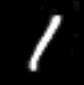 | 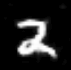 | 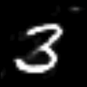 | 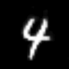

| 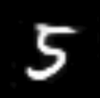 | 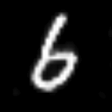 | 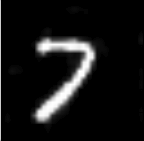 | 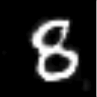 | 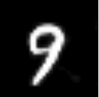

### 2) DCGAN-MNIST (Deep Convolutional GAN)

* Train a DCGAN on the MNIST dataset without any class priors. Inputs are (100) dimensional noise vectors and the outputs are generated (1,28,28) images
* Samples of generated outputs in `DCGAN-MNIST/GeneratedOutputs`
* Trained generator and discriminator models in `DCGAN-MNIST/TrainedModels`
* Generated digit samples below

| 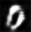 | 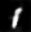 | 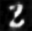 | 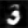 | 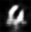

| 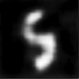 | 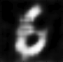 |  | 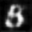 | 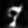

Note: Training the GAN for longer would give us much better results, which are not as blurry.

